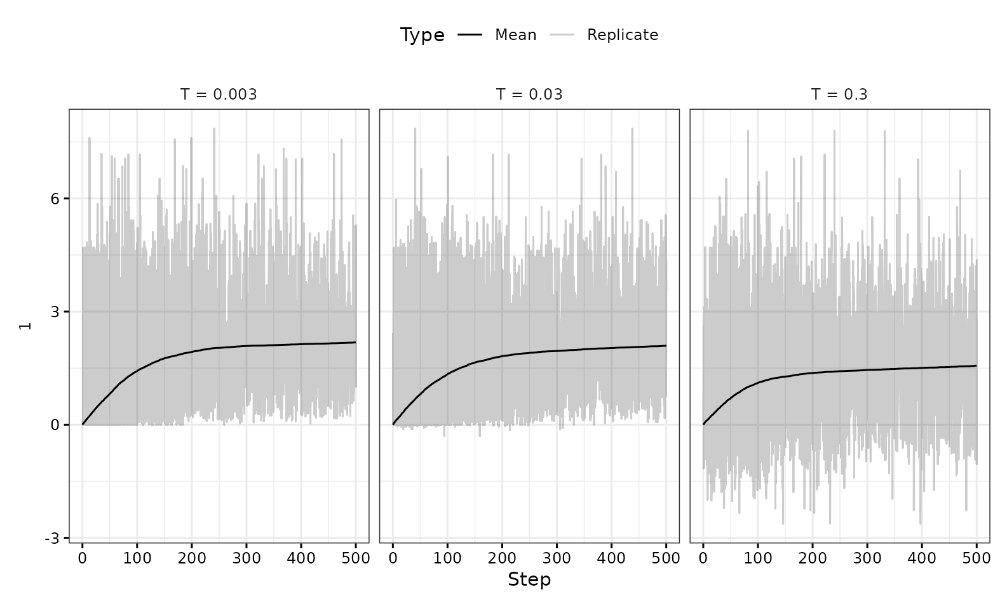

# Concept of EVmutation-based *in silico* evolution

Code in this repository helps to identify a zero-shot prediction ([Wittmann et al., 2021](https://doi.org/10.1016/j.cels.2021.07.008)) for a higher-order mutant variant library in case there is no prior experimental information. To do so, it uses a Metropolis-Hastings Markov algorithm ("*in silico evolution*") to navigate a fitness landscape given by the phylogeny-guided model calculated by [EVcouplings](https://v2.evcouplings.org/).
Other algorithms to predict the fitness of higher-order mutant protein variants could theoretically also be used to give a fitness measure for the in silico evolution approach, compare for instance [https://www.proteingym.org/substitutions](https://www.proteingym.org/substitutions).

# System requirements

## Hardware

All scripts were run on a regular laptop. 

## Software

| Software | Version | Tested version | Note |
| -------- | ------- | -------------- | --------- |
| OS | | Ubuntu 22.04 | |
| Bash | | 5.1.16 | |
| conda | | 4.12.0 | Installed using Anaconda, but Miniconda should be sufficient |
| mamba | | 0.7.6 | |
| Python | >3.6 | 3.6.15 | installed using conda environment |
| R | | 4.3.1 | with package tidyverse v1.3.1|


# Installation

Clone this repository

```bash
git clone https://github.com/ute-hoffmann/EVmut_inSilico
```

Set up conda environment, run this command on shell from within folder in which file [evmut_insilico.yml](evmut_insilico.yml) is located - use preferentially mamba to resolve environment!

```bash
mamba env create -f evmut_insilico.yml
```

# Usage

## Retrieval of EVcouplings model file

For a new protein sequence: Retrieve the respective amino acid sequence, for instance from Uniprot. Run the EVcouplings web server using default settings for the sequence to create a EVcouplings model ([https://v2.evcouplings.org](https://v2.evcouplings.org/)). To obtain good predictions, the created multiple sequence alignment should feature a sufficient number of sequences. Download the created EVcouplings model from the "Dowloads" tab of the provided results using the button "EVcouplings model parameters". Note that it is not part of the ZIP archive file with all results.

## *in silico* evolution without prior information on amino acid positions

Adjust the file [iterate_inSilicoEvolution.sh](src/iterate_inSilicoEvolution.sh) to contain the correct path to the EVcouplings model (parameter EVmodel). Other parameters that can be changed are the number of replicates, steps in the in silico trajectory, trust radius, the job specific name and the temperatures that are to be tested.
To run the code, you do also need the original wild-type input sequence (parameter input_sequence). This sequence file and the EVcouplings model file are expected to be located in the [input](input) directory. 

To run in silico evolutions, activate the conda environment and run the following commands from the base folder of the repository: 

```bash
conda activate evmut_insilico
bash src/iterate_insilicoEvolution.sh
```

Depending on the hardware, the chosen number of iterations and temperatures, this will run for several hours (e.g. 15 hours for 2000 replicates, 3 temperatures, 500 steps per trajectory and a 450 amino acid long input sequence).

When finished, plot the obtained fitness values for different temperatures using the following command (parameter -j gives job_specific_name, which is part of the in directory path - this corresponds to the parameter "job_specific_name" in [iterate_inSilicoEvolution.sh](src/iterate_inSilicoEvolution.sh)).

```bash
python src/prepare_df_for_plotting.py -j Gallionella_cbbM
```
The script creates the file [collect_data_plotting.csv](results/Gallionella_cbbM/collect_data_plotting.csv) with all data for replicates, steps, temperatures etc. The next script creates plots for the obtained data. It assumes trajectories with 500 steps - if a different number of steps was chosen, adjust the code accordingly (line 13 in ([plot_fitness_perStep.R](src/plot_fitness_perStep.R)). To find the correct file, the "job_specific_name" set above has to be specified as parameter for the script (in this example "Gallionella_cbbM").

```bash
Rscript src/plot_fitness_perStep.R Gallionella_cbbM
```

The created plots can be used to decide on a temperature for the "in silico" sampling. Lower temperatures lead to more conservative sequence suggestions and may potentially limit the algorithm to get out of local maxima. Higher temperatures give more diverse suggestions, but might not converge to a local maximum. Here, a temperature of 0.03 was chosen for further analyses.



In the following step, the best protein sequences in each trajectory that was run for the specified temperature are extracted (output file [Temperature_0.03_bestSequencesTrajectory.csv](results/Gallionella_cbbM/Temperature_0.03_bestSequencesTrajectory.csv)). These are compared to the wild-type sequence and introduced amino acid exchanges are determined (output file [Sequences_Fitness_Point-Mutations.csv](results/Gallionella_cbbM/Sequences_Fitness_Point-Mutations.csv)). Finally, a file is created indicating which amino acid exchanges occurred most frequently (output file [countMutations_limitedPos.csv](results/Gallionella_cbbM/countMutations_limitedPos.csv)).

```bash
python src/extract_and_count.py -j Gallionella_cbbM -s input/Gallionella_Rubisco.txt -T 0.03
```

These frequencies and a brief test which amino acid exchanges co-occur most frequently can be used to decide on protein sequences that should be tested experimentally. Alternatively, a sub-set of amino acid positions can be chosen and used for another round of in silico evolution to test which of these positions do co-occur most frequently. 

## *in silico* evolution with a limited number of possible positions

Run *in silico* evolution again with only limited number of amino acids, check which sequences pop up most frequently together and check their fitness score

# Citing supporting repositories

Loosely based on [github.com/Asplund-Samuelsson/furee/blob/master/source/in_silico_evolution.py](https://github.com/Asplund-Samuelsson/furee/blob/master/source/in_silico_evolution.py),
EVmutation code from [github.com/fhalab/MLDE/](https://github.com/fhalab/MLDE/). Code for the Metropolis-Hastings Markov chain is based on [github.com/ElArkk/jax-unirep/tree/master](https://github.com/ElArkk/jax-unirep/tree/master). Please cite publications connected to these repositories.


